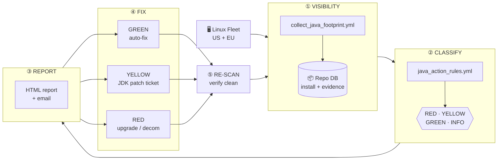

# Java Footprint Audit — Project Overview

> Lifecycle management for every Java install on our Oracle DB fleet
> Last updated: 2026-06-02

---

## 1. The problem in one paragraph

Java lives in many places on our Oracle hosts: inside each DB home, inside
OPatch, inside the OEM Agent and OMS, inside Gateway homes, and at the OS
level (`/usr/lib/jvm`). Each of those Java copies has its own version, its
own owner, and its own supported way of being patched. We did not have a
single inventory of all of them. That meant security findings were a
surprise, audits took weeks of manual work, and DBAs sometimes "fixed" Java
in ways Oracle does not support (e.g. dropping a new JDK into an Oracle
home). This project replaces that with one automated, repeatable lifecycle.

---

## 2. The 5 steps

### ① VISIBILITY — *find every Java*
A pure-shell Ansible scan walks every host and records each `java` binary it
finds, plus enough surrounding evidence to know **what it is, who owns it,
and whether it is in use**: RPM ownership, symlink targets, vendor.properties,
live processes, listening ports, references in env-files / systemd / cron,
legacy 1.6/1.7 RPMs, and the system-default (`/etc/alternatives/java`).
All of that lands in the central repo DB.

### ② CLASSIFY — *decide what to do with each one*
The rules in `vars/java_action_rules.yml` map an install path (e.g.
`/oracle/.../19.x/dbhome/jdk/...`) to a risk tier and a named action method:

| Tier | Meaning | Who acts |
|---|---|---|
| 🟢 **GREEN** | Safely remediable now (yum/dnf, cleanup) | Linux / DBA · automated |
| 🟡 **YELLOW** | Needs vendor JDK Bundle Patch via OPatch / OEM | DBA · ticketed |
| 🔴 **RED** | EOL — no JDK patch path exists | Project · upgrade or decom |
| ⚪ **INFO** | Updated by its parent component (e.g. OPatch) — leave alone | DBA · informational |

A daily MERGE keeps the rules table in sync with the YAML.

### ③ REPORT — *make it visible to humans*
`report_java_scan_run.yml` reads the repo (no host re-scan) and produces an
HTML report plus a UTF-8 email. The report has KPIs, fleet status by worst
tier, a per-host action plan with evidence chips and RPM names, and an
outdated-Java detail table. Filters are supported for a single run or a host
subset.

### ④ FIX — *do the work, by tier*
- **GREEN** is automated by `remediate_java_safe.yml`: `dnf remove`/`update`,
  cleanup of stale OPatch backup dirs. Always `--check`/`--diff` first.
- **YELLOW** drives a DBA / OEM ticket using the MOS-noted procedure in the
  rule's precheck note. Manual today; planned ticket-tracking table next.
- **RED** is not patchable; it goes onto the upgrade/decommission project list.

### ⑤ RE-SCAN — *prove it's clean*
After a fix, a scoped scan of the affected hosts auto-merges into the next
report (latest-scan-per-host view), so the finding either disappears or we
can see why it didn't.

---

## 3. Where we are today

| Step | Status | Evidence |
|---|---|---|
| ① Visibility | ✅ US live · ⏳ EU DDL pending | 62 hosts / 510 installs captured with full evidence |
| ② Classify | ✅ | 17 rules · 0 unclassified installs in latest run |
| ③ Report | ✅ | Regenerates in ~30 s; archived under `logs/oracle_options_audit/` |
| ④ Fix | ⚠️ GREEN playbook exists, needs revalidation · YELLOW manual · RED scoped | Latest report flags **5 RED** (2 PROD: `crlnxp083`, `crlnxp140` with Java 1.5 in 10g homes) and **57 YELLOW** mapped to JDK Bundle Patch procedures |
| ⑤ Re-scan | ✅ manual mop-up works · ⏳ close-out automation pending | Mop-up scan on 2026-06-02 merged cleanly |

---

## 4. What's next (in order)

1. **EU rollout.** Apply `vars/java_evidence_ddl.sql` on the EU repo and run
   the first EU scan so we have one global picture, not just US.
2. **Re-validate GREEN auto-fix** (`remediate_java_safe.yml`) against the
   current rule strings, then dry-run on TEST.
3. **Ticket tracking table** (`JAVA_PATCH_TICKETS`) so YELLOW work is followed
   from *opened → patch applied → re-scan verified*, not just listed in a
   report.
4. **Daily automation.** Wrap collection, rules-load, and report as OEM cron
   jobs on `crlnxp1086`; vault the repo password.
5. **PROD RED decision** with App teams on `crlnxp083` and `crlnxp140`:
   upgrade, lift-and-shift, or decommission those 10g homes.

---

## 5. Why this matters (the value)

- **One source of truth.** Security and audit asks are answered from the repo
  in seconds, not from a spreadsheet rebuilt every quarter.
- **Lifecycle, not point-in-time.** Every fix is verified by a re-scan and
  visible in the next report — we can prove the fleet got cleaner over time.
- **Safe by design.** The rule-set prevents anyone from "auto-fixing" a JDK
  inside an Oracle home; only Oracle-supported paths are GREEN.
- **Less DBA toil.** GREEN work runs unattended. YELLOW work arrives with the
  exact MOS-noted procedure already attached. RED items surface as a
  project decision, not a 2 a.m. surprise.
- **Same code for US and EU.** One playbook, two repo configs.

---

## 6. Risks & considerations

- **No in-place JDK swaps inside Oracle homes.** Oracle only supports JDK
  Bundle Patches applied via OPatch. The ruleset reflects this by labeling
  those installs YELLOW + MOS reference, never GREEN.
- **OPatch's bundled JRE is INFO.** It is updated when OPatch itself is
  updated. Manual replacement breaks OPatch.
- **OEM Agent JDK** changes require an emctl agent restart — coordinate with
  the OEM admin.
- **GREEN auto-fix uses `dnf` and `rm -rf`.** We always run `--check`/`--diff`
  first and gate removals on `rpm -q --whatrequires` so apps that still need
  Java 7/8 are not broken.
- **EOL homes (10g / 11g / 12.1) have no JDK patch path.** No amount of
  patching cleans them; they need a project decision.
- **Repo password** is on the command line today. Move to vaulted `f.s`
  before the daily cron job goes in.
- **Report default scope** is *latest scan per host*. A partial re-scan never
  erases older hosts; use `host_filter=...` only for targeted work.

---

Latest US report and evidence: `logs/oracle_options_audit/`.
