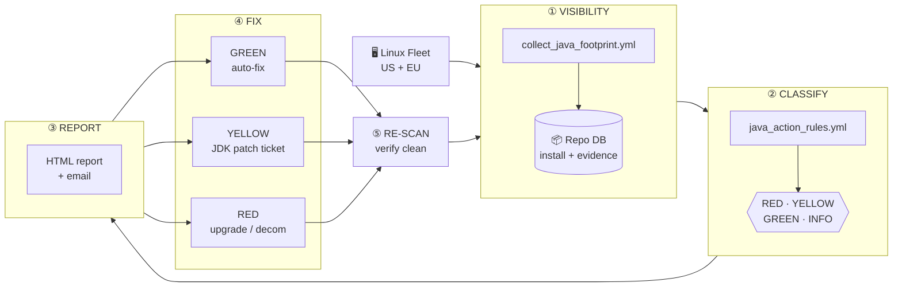

# Java Footprint Audit — Project Overview

> Lifecycle management for every Java install on our Oracle DB fleet
> Last updated: 2026-06-11

---

## 1. The problem in one paragraph

Java lives in many places on our Oracle hosts: inside each DB home, inside
OPatch, inside the OEM Agent and OMS, inside Gateway homes, and at the OS
level (`/usr/lib/jvm`). Each of those Java copies has its own version, its
own owner, and its own supported way of being patched. We did not have a
single inventory of all of them. That meant security findings were a
surprise, audits took weeks of manual work, and DBAs sometimes "fixed" Java
in ways Oracle does not support (e.g. dropping a new JDK into an Oracle
home). This project replaces that with one automated, repeatable lifecycle.

---

## 2. The 5 steps



### ① VISIBILITY — *find every Java*
A pure-shell Ansible scan walks every host and records each `java` binary it
finds, plus enough surrounding evidence to know **what it is, who owns it,
and whether it is in use**: RPM ownership, symlink targets, vendor.properties,
live processes, listening ports, references in env-files / systemd / cron,
legacy 1.6/1.7 RPMs, and the system-default (`/etc/alternatives/java`).
All of that lands in the central repo DB.

### ② CLASSIFY — *decide what to do with each one*
The rules in `vars/java_action_rules.yml` map an install path (e.g.
`/oracle/.../19.x/dbhome/jdk/...`) to a risk tier and a named action method:

| Tier | Meaning | Who acts |
|---|---|---|
| 🟢 **GREEN** | Safely remediable now (yum/dnf, cleanup) | Linux / DBA · automated |
| 🟡 **YELLOW** | Needs vendor JDK Bundle Patch via OPatch / OEM | DBA · ticketed |
| 🔴 **RED** | EOL — no JDK patch path exists | Project · upgrade or decom |
| ⚪ **INFO** | Updated by its parent component (e.g. OPatch) — leave alone | DBA · informational |

A daily MERGE keeps the rules table in sync with the YAML.

### ③ REPORT — *make it visible to humans*
`report_java_scan_run.yml` reads the repo (no host re-scan) and produces an
HTML report plus a UTF-8 email. The report has KPIs, fleet status by worst
tier, a per-host action plan with evidence chips and RPM names, and an
outdated-Java detail table. Filters are supported for a single run or a host
subset.

### ④ FIX — *do the work, by tier*
- **GREEN** is automated by `remediate_java_safe.yml`: `dnf remove`/`update`,
  cleanup of stale OPatch backup dirs. Always `--check`/`--diff` first.
- **YELLOW** drives a DBA / OEM ticket using the MOS-noted procedure in the
  rule's precheck note. Manual today; planned ticket-tracking table next.
- **RED** is not patchable; it goes onto the upgrade/decommission project list.

### ⑤ RE-SCAN — *prove it's clean*
After a fix, a scoped scan of the affected hosts auto-merges into the next
report (latest-scan-per-host view), so the finding either disappears or we
can see why it didn't.

---

## 3. Repositories

| Site | Jumpbox | DB | TNS Alias | Schema | Config file |
|---|---|---|---|---|---|
| **US** | `crlnxp1086` | `crlnxd1046:1535` SID `dbai` | `dbai` | `mtaheri` | `vars/java_scanner_config.yml` |
| **EU** | `uklnxagt0107` | `UKLNXAGT0107:1525` SERVICE `DBAINFO` | `DBAINFO` | `mtaheri` | `vars/java_scanner_config_eu.yml` |

Secrets: `secrets.local` at repo root (never inside `playbooks/`).

---

## 4. Run commands

All commands run from the **repo root** (`/home/svcorap/mohsen/ansible` on US, `/homedir/svcorapeu/mohsen/Oracle-DBA-Automation-Projects-main/v1.5` on EU).

### One-time repo setup (run once per environment, idempotent to re-run)

```bash
# Step 1 — create/upgrade tables, indexes, base views
ansible-playbook playbooks/_setup_java_scan_tables.yml \
  -i localhost, -c local -e @secrets.local -e ansible_become=false
# EU:
ansible-playbook playbooks/_setup_java_scan_tables.yml \
  -e @vars/java_scanner_config_eu.yml -e "repo_password=<eu_pwd>"

# Step 2 — add evidence columns (IS_SYMLINK, RPM_OWNER, LIVE_PROCS, etc.)
sqlplus mtaheri/<pwd>@dbai @vars/java_evidence_ddl.sql
# EU:
sqlplus mtaheri/<eu_pwd>@DBAINFO @vars/java_evidence_ddl.sql

# Step 3 — create ownership + team views
sqlplus mtaheri/<pwd>@dbai @scripts/java_owner_views.sql
# EU:
sqlplus mtaheri/<eu_pwd>@DBAINFO @scripts/java_owner_views.sql

# Step 4 — load classification rules
ansible-playbook playbooks/update_java_action_rules.yml \
  -i localhost, -c local -e @secrets.local -e ansible_become=false
# EU:
ansible-playbook playbooks/update_java_action_rules.yml \
  -e @vars/java_scanner_config_eu.yml -e "repo_password=<eu_pwd>"

# Step 5 — load Java version reference (target versions)
ansible-playbook playbooks/update_java_reference.yml \
  -i localhost, -c local -e @secrets.local -e ansible_become=false
# EU:
ansible-playbook playbooks/update_java_reference.yml \
  -e @vars/java_scanner_config_eu.yml -e "repo_password=<eu_pwd>"
```

### Regular scan + report cycle

```bash
# ── US ──────────────────────────────────────────────────────────────────
# Scan all US hosts
ansible-playbook playbooks/collect_java_footprint.yml \
  -i inv_key.yml \
  -e @secrets.local \
  -e "run_label=Java-Scan-US-$(date +%Y%m%d)" \
  -f 10

# Generate general scan report (HTML + email)
ansible-playbook playbooks/report_java_scan_run.yml \
  -i inv_key.yml -e @secrets.local

# Generate team distribution reports (DBA / OEM / OS)
ansible-playbook playbooks/report_java_team_distribution.yml \
  -i localhost, -c local -e @secrets.local \
  -e ansible_become=false -e send_team_email=false

# ── EU ──────────────────────────────────────────────────────────────────
# Scan all EU hosts (Linux UK + AIX; NL hosts need DNS fix — see §7)
ansible-playbook -i ansibleInventory/inv_key.yml \
  playbooks/collect_java_footprint.yml \
  -l all_eu \
  -e @vars/java_scanner_config_eu.yml \
  -e "run_label=Java-Scan-EU-ALL-$(date +%Y%m%d)" \
  -e "repo_password=<eu_pwd>" \
  -f 10

# Generate general scan report (EU)
ansible-playbook -i ansibleInventory/inv_key.yml \
  playbooks/report_java_scan_run.yml \
  -e @vars/java_scanner_config_eu.yml \
  -e "repo_password=<eu_pwd>"

# Generate team distribution reports (EU)
ansible-playbook playbooks/report_java_team_distribution.yml \
  -i localhost, -c local \
  -e @vars/java_scanner_config_eu.yml \
  -e "repo_password=<eu_pwd>" \
  -e ansible_become=false -e send_team_email=false
```

### Targeted / mop-up scan (single host or group)
```bash
# US — single host
ansible-playbook playbooks/collect_java_footprint.yml \
  -i inv_key.yml -l crlnxp083 -e @secrets.local

# EU — single host
ansible-playbook -i ansibleInventory/inv_key.yml \
  playbooks/collect_java_footprint.yml \
  -l uklnxpuk1015 \
  -e @vars/java_scanner_config_eu.yml -e "repo_password=<eu_pwd>"
```

---

## 5. Where we are today (2026-06-11)

| Step | US | EU |
|---|---|---|
| ① Visibility | ✅ ~62 hosts / 510 installs | ✅ 37 hosts / 258 installs (12 NL hosts DNS-blocked) |
| ② Classify | ✅ 26 rules · 0 unclassified | ✅ 26 rules · 0 unclassified |
| ③ Report — scan | ✅ | ✅ |
| ③ Report — team dist. | ✅ DBA/OEM/OS HTML | ✅ DBA/OEM/OS HTML |
| ④ Fix | ⚠️ YELLOW manual · RED scoped | ⚠️ YELLOW manual |
| ⑤ Re-scan | ✅ mop-up works | ✅ |

**US latest:** 380 rows — RED 10, YELLOW 370. DBA queues: OPatch 99, patch-cycle 357, legacy 20, Oracle-home 346.
**EU latest:** 258 installs — all YELLOW, 0 RED. DBA: 203 rows / 33 hosts. OEM: 2 rows (OMS on `uklnxagt0107`). OS: 54 rows / 33 hosts.

**EU known gaps:**
- 11 NL hosts unreachable — DNS resolution failure from UK jumpbox. Raise with network team to add `uklnxpnl*` / `uklnxtnl*` to DNS or `/etc/hosts` on `uklnxagt0107`.
- `uklnxmuk1002` — SSH key not deployed for `svcoradeu`.

---

## 6. What's next (in order)

1. **Fix EU NL DNS** — add NL hostnames to UK jumpbox DNS or `/etc/hosts` so 11 missing PROD NL hosts can be scanned.
2. **Deploy `svcoradeu` SSH key** to `uklnxmuk1002`.
3. **Re-validate GREEN auto-fix** (`remediate_java_safe.yml`) against current rule strings, then dry-run on TEST.
4. **Ticket tracking table** (`JAVA_PATCH_TICKETS`) so YELLOW work is tracked open → patched → re-scan verified.
5. **Daily automation** — OEM cron on `crlnxp1086` (US) and `uklnxagt0107` (EU); vault the repo passwords.
6. **PROD RED decision** — `crlnxp083`, `crlnxp140` (10g homes, Java 1.5): upgrade, lift-and-shift, or decommission.

---

## 7. Why this matters (the value)

- **One source of truth.** Security and audit asks are answered from the repo
  in seconds, not from a spreadsheet rebuilt every quarter.
- **Lifecycle, not point-in-time.** Every fix is verified by a re-scan and
  visible in the next report — we can prove the fleet got cleaner over time.
- **Safe by design.** The rule-set prevents anyone from "auto-fixing" a JDK
  inside an Oracle home; only Oracle-supported paths are GREEN.
- **Less DBA toil.** GREEN work runs unattended. YELLOW work arrives with the
  exact MOS-noted procedure already attached. RED items surface as a
  project decision, not a 2 a.m. surprise.
- **Same code for US and EU.** One playbook, two repo configs.

---

## 8. Risks & considerations

- **No in-place JDK swaps inside Oracle homes.** Oracle only supports JDK
  Bundle Patches applied via OPatch. The ruleset reflects this by labeling
  those installs YELLOW + MOS reference, never GREEN.
- **OPatch's bundled JRE is INFO.** It is updated when OPatch itself is
  updated. Manual replacement breaks OPatch.
- **OEM Agent JDK** changes require an emctl agent restart — coordinate with
  the OEM admin.
- **GREEN auto-fix uses `dnf` and `rm -rf`.** We always run `--check`/`--diff`
  first and gate removals on `rpm -q --whatrequires` so apps that still need
  Java 7/8 are not broken.
- **EOL homes (10g / 11g / 12.1) have no JDK patch path.** No amount of
  patching cleans them; they need a project decision.
- **Repo password** is on the command line today. Move to vaulted `f.s`
  before the daily cron job goes in.
- **Report default scope** is *latest scan per host*. A partial re-scan never
  erases older hosts; use `host_filter=...` only for targeted work.

---

Latest US report and evidence: `logs/oracle_options_audit/`.
Latest EU reports: `/homedir/svcorapeu/mohsen/Oracle-DBA-Automation-Projects-main/v1.5/reports/`.
Direct repo checks: `scripts/java_repo_checks.sql` (run against US `dbai` or EU `DBAINFO`).
